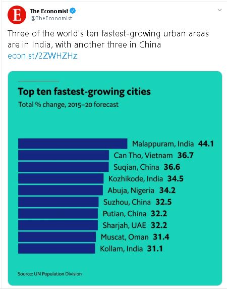

```{r setup, include=FALSE}
library(flexdashboard)
```

Column {data-width=1000}
-----------------------------------------------------------------------

### **Are the World's Fastest Growing Cities in India?**

| | |
|:------------------------------------------|----------------:|
|Recently, a chart from the *World In Figures* portal of the *The Economist* titled the ["Fastest Growing Cities"](https://worldinfigures.com/rankings/index/24) has been [widely shared](https://twitter.com/TheEconomist/status/1214593942307651584) and discussed on social media platforms. What surprised many people was that three Indian cities, all from the state of Kerala, appeared among the top 10 fastest growing cities in the world. Especially Malappuram, a Muslim-majority region, occupying the first slot gave rise to several reactions tainted with religious ill will. Some attributed it to the recent wave of migration of labourers from the North. While it is well known that Kerala has a rather unusually spread-out spatial distribution of settlements and that the state underwent a major exit of the workforce from the agricultural sector over the past decades, in the public imagination the cities and towns of Kerala have never been the fastest-growing urban centres of India. In this article, we try to unpack some of the numbers that went into making this chart and check how appropriate it is to term these cities as the fastest growing. <br><br> Firstly, since what you call a "city" and what is meant by "fast growth" are quite subjective, let us understand what information the chart actually carries. In fact, the plot shows the urban agglomerations with a population of 1 million or more as of 2015, arranged in terms of the projected growth in their population for 2015-20. The term Urban Agglomeration (UA) refers to a cluster of urbanised areas that are very near each other, which could be treated as one single city for most practical purposes. Often a UA includes multiple administrative units. | {width=260px}|

#### **What Does the Data Say?**

According to *The Economist* website, the *the fastest-growing cities* chart was prepared using data from the United Nations Population Division. This data can be found on the [World Urbanization Prospects 2018](https://population.un.org/wup/) website, in the Urban Agglomerations section. As described in their [working paper](https://population.un.org/wup/Publications/Files/WUP2018-Methodology.pdf), they gathered population data from all over the world and made projections for the years for which there was no data available. The UA-level population numbers for India are derived from the Census of India data sets.   

We now take a look at the UN Population Division data and check what it tells us about the growth of urban agglomerations around the world.

```{r}
library(tidyverse)
library(readxl)
library(gridExtra)

ua_pop <- read_excel("data/WUP2018-F12-Cities_Over_300K.xls",
                     skip = 17,
                     col_names = c('index', 'country_code', 'country', 'city_code', 'ua_name', 'note',
                                   'lat', 'long', 'pop_1950', 'pop_1955', 'pop_1960', 'pop_1965',
                                   'pop_1970', 'pop_1975', 'pop_1980', 'pop_1985', 'pop_1990',
                                   'pop_1995', 'pop_2000', 'pop_2005', 'pop_2010', 'pop_2015',
                                   'pop_2020', 'pop_2025', 'pop_2030', 'pop_2035'))

ua_pop_global <- ua_pop %>% 
  select(ua_name, pop_2010, pop_2015, pop_2020) %>% 
  mutate(
    growth = round((pop_2020 - pop_2015) / pop_2015 * 100, 2),
  ) 


p1 <- ua_pop_global %>% 
  arrange(desc(growth)) %>% 
  head(30) %>% 
  ggplot(aes(x = reorder(ua_name, growth), y = growth)) + 
    geom_bar(stat = 'identity') +
    geom_text(aes(label=paste0(growth, " %")), size = 2.5, hjust=-0.1) +
    coord_flip() +
    ylab("Population Growth \n 2015-20 \n All UAs") +
    xlab("UA Name") +
    ylim(c(0, 160)) +
    ggthemes::theme_tufte() +
    theme(axis.title = element_text(size=8, face="bold"))

p2 <- ua_pop_global %>% 
  filter(pop_2015 > 1000) %>% 
  arrange(desc(growth)) %>% 
  head(30) %>% 
  ggplot(aes(x = reorder(ua_name, growth), y = growth)) + 
    geom_bar(stat = 'identity') +
    geom_text(aes(label=paste0(growth, " %")), size = 2.5, hjust=-0.1) +
    coord_flip() +
    ylab("Population Growth \n 2015-20 \n Large UAs") +
    xlab("") +
    ylim(c(0, 160)) +
    ggthemes::theme_tufte() +
    theme(axis.title = element_text(size=8, face="bold"))

gridExtra::grid.arrange(p1, p2, nrow = 1,
                        bottom = grid::textGrob("Source: UN Population Division", x = 1,
                                                hjust = 1, 
                                                gp = grid::gpar(fontsize = 5)))
```

This visualisation shows the fastest growing UAs, first taking all the UAs and then picking only those with a population of at least 1 million in 2015. The large-UA chart is very close to the ranking that was published on *The Economist* portal, with some minor differences in the decimal digits. The important point to note is that there are faster growing UAs compared to Malappuram, but they did not meet the population threshold of the chart that was published. Some of these, like Hosur in Tamil Nadu, are quite large.  

Now let us zoom into the ranking of the Indian UAs.  

```{r}
ua_pop_india <- ua_pop %>% 
  filter(country == "India") %>% 
  select(ua_name, pop_2000, pop_2010, pop_2015, pop_2020) %>% 
  mutate(
    growth_2010 = round((pop_2010 - pop_2000) / pop_2000 * 100, 2),
    growth_2020 = round((pop_2020 - pop_2015) / pop_2015 * 100, 2)
  )

p1 <- ua_pop_india %>% 
  arrange(desc(growth_2010)) %>% 
  head(30) %>% 
  ggplot(aes(x = reorder(ua_name, growth_2010), y = growth_2010)) + 
    geom_bar(stat = 'identity') +
    geom_text(aes(label=paste0(growth_2010, " %")), size = 2.5, hjust=-0.1) +
    coord_flip() +
    ylab("Population Growth % \n (2000-10)") +
    xlab("UA Name") +
    ylim(c(0, 180)) +
    ggthemes::theme_tufte() +
    theme(axis.title = element_text(size=8, face="bold"))

p2 <- ua_pop_india %>% 
  arrange(desc(growth_2020)) %>% 
  head(30) %>% 
  ggplot(aes(x = reorder(ua_name, growth_2020), y = growth_2020)) + 
    geom_bar(stat = 'identity') +
    geom_text(aes(label=paste0(growth_2020, " %")), size = 2.5, hjust=-0.1) +
    coord_flip() +
    ylab("Population Growth % \n (2015-20 Forecast)") +
    xlab("")  +
    ylim(c(0, 85)) + 
    ggthemes::theme_tufte() +
    theme(axis.title = element_text(size=8, face="bold"))

gridExtra::grid.arrange(p1, p2, nrow = 1,
                        bottom = grid::textGrob("Source: UN Population Division", x = 1,
                                                hjust = 1, 
                                                gp = grid::gpar(fontsize = 5)))
```


The above plots show that Hosur is the UA that experienced the fastest growth. However, after we select cities with a population of at least 1 million, Hosur and other smaller cities get excluded. We see that the 5-year growth projection for 2015-20 is almost equal to half the 2000-10 decadal growth, indicating that the method effectively assumes that more or less the same pace of urbanisation will continue in the short term.

#### **Growth of UAs in Kerala**

Now, to put things in perspective, let us examine further details of some of the Indian UAs, especially the ones in Kerala that appear in *The Economist* plot. This is using the Census of India data.


```{r fig.width=8}
library(directlabels)
library(ggrepel)

pop_ts <- read_csv("data/ua_pop_time_series_census2011.csv")

pop_ts %>% 
  filter(UA %in% c("Bangalore", "Chennai", "Delhi", "Coimbatore",
                    "Mumbai", "Malappuram", "Kozhikode", "Kollam")) %>% 
  mutate(
    UA = reorder(UA, Area)
  ) %>% 
  gather(key = "var", value = "value", Area, Population) %>% 
  ggplot(aes(x = Year, y = value, colour= UA)) +
    geom_line() +
    geom_point() +
    scale_colour_discrete(guide = 'none') +
    scale_y_continuous(label=scales::comma) +
    geom_dl(aes(label = UA), method = list(dl.trans(x = x + 0.2), "last.bumpup", cex = 0.6)) +
    xlim(c(1970, 2020)) +
    ylab("") +
    facet_wrap(~var, scale = "free") +
    labs(caption = "Source: Census 2011") +
    ggthemes::theme_few()
   
```

This chart captures the growth in area (in square km) and population of the Kerala UAs Malappuram, Kozhikode, and Kollam and compares them against some of the larger UAs in the country. A pattern that stands out is that the Kerala UAs had a massive manyfold increase in their area in the 2011 census, while the population did not jump up as much. This is clearly because the Census in 2011 recognised significantly more towns and outgrowths as urban, and included many of those in the nearest UA. Although the natural growth in population and increase in population density played a role in more areas getting classified as urban, the most important factor was the fast decline in agricultural employment in and around the existing urban centres. As we see in the figure below, a major part of this change happened during the 1990s, and the 2011 Census in fact did a catch-up job in reclassifying several villages as census towns. In that sense, this jump in urbanisation is a discontinuity introduced by how the Census machinery operates. The actual transition of the workforce out of agriculture arguably happened in a smooth and gradual manner.  

```{r fig.height=6, fig.width=8}
workers <- read_csv('data/male_main_workers.csv')

workers %>% 
  gather(key = "Year", value = "non_agri_labour", `1991`, `2001`, `2011`) %>% 
  mutate(
    non_agri_labour = round((1 - non_agri_labour) * 100, 2),
    Year = as.numeric(Year),
    District = factor(District)
  ) %>% 
  ggplot(aes(x = Year, y = non_agri_labour, colour = District)) +
    geom_line() +
    geom_point() +
    theme_minimal() +
    xlab("Year") +
    ylab("Non-Agricultural Labour %") +
    ylim(c(0, 119)) +
    xlim(c(1990, 2021)) +
    labs(caption = "Source: Census 1991, 2001 & 2011") +
    scale_colour_discrete(guide = 'none') +
    geom_dl(aes(label = District), 
            method = list(dl.trans(x = x + 0.2), "last.bumpup", cex = 0.7))
```

#### Potential for Further UA Growth - District Populations

Some of the large UAs in Kerala cover most of the urban areas of the respective districts (often named the same as the UA). In the below plots, we show how much of the area and population of the district the corresponding main UA covers.

```{r fig.height=3}
dist_ua <- read_csv('data/kerala_ua_district_pop.csv')

dist_ua %>% 
  mutate(
    UA = reorder(UA, `District Population`)
  ) %>%
  gather(key = "var", value = "value", 
         `UA Population`, `District Population`, `District Urban Population`) %>% 
    ggplot(aes(x = UA, y = value, fill = var)) +
      geom_bar(position = 'dodge', stat = 'identity') +
      scale_y_continuous(label=scales::comma) +
      coord_flip() +
      ggthemes::theme_tufte() +
      xlab("UA Name") +
      ylab("Population") +
      labs(caption = "Source: Census 2011",
           fill = NULL)

```

The below plot shows the population growth in all the 14 districts of Kerala over the decades. While Malappuram is seeing a steady increase in both its population and population density, Kozhikode district has had a moderate increase and in Kollam, the growth has started tapering off. 

```{r fig.width=8}
## Data from http://www.censusindia.gov.in/2011census/PCA/A2_Data_Table.html and
## http://www.censusindia.gov.in/2011census/maps/atlas/32part1.pdf

decadal <- read_excel('data/32 A-2 Kerla Final.xlsx',
                      skip = 5,
                      col_names = c("1", "2", "District", "Year", "Population",
                                    "6", "7", "8", "9"))

areas <- read_csv('data/kerala_district_areas.csv')

decadal <- decadal %>% 
  select(District, Year, Population) %>% 
  filter(!is.na(Year)) %>% 
  mutate(
    District = zoo::na.locf(District)
  ) %>% 
  filter(District != "KERALA") %>% 
  filter(Year >= 1951) %>% 
  inner_join(areas, by = "District") %>% 
  mutate(
    Density = Population / Area
  )

decadal %>% 
  gather(key = "var", value = "value", Population, Density) %>% 
  ggplot(aes(x = Year, y = value, colour = District)) +
    geom_point() +
    geom_line() +
    scale_y_continuous(label=scales::comma) +
    scale_colour_discrete(guide = 'none') +
    geom_dl(aes(label = District), method = list(dl.trans(x = x + 0.2), "last.bumpup", cex = 0.6)) +
    labs(caption = "Source: Census 2011") +
    xlim(c(1950, 2040)) +
    ylab("") +
    facet_wrap(~reorder(var, -value), scale = "free") +
    ggthemes::theme_few()
```

#### So, what does all this mean?

We could make the following conclusions:  

 * As the UN Population Division portal clearly states, different countries classify urban and rural areas differently. Also, the decision on what constitutes an urban agglomeration or a metropolitan area may also vary significantly from country to country. So, an analysis comparing cities across the world is limited by all such inconsistencies in the data. 
 
 * The chart published on *The Economist* portal uses a specific population threshold (1 million as of 2015) to select relatively larger cities. A slightly lower or higher value for this would have given us a different list of fastest-growing cities.  
 
 * The sudden jump in the area of several Kerala UAs in the 2011 census is mostly a reflection of the change in the employment pattern of the male workforce that happened over the earlier decades. 
 * The UN data assumes certain linear trend of growth in the near future based on the recent Census values, and it may not be accurate for many of the Kerala UAs where a large fraction of villages with a non-agricultural nature of employment are already classified as urban. E.g. two-thirds of the population in Kozhikode district was identified as urban in the 2011 Census.
 
 * While the Kerala UAs pass the Census criteria on population, population density, and non-agriculture workforce, many of these areas lack certain functional characteristics and infrastructure usually associated with cities, e.g. water supply, sewage network. The structure of the economy remains heavily remittance-based.  

---  

---  

*Urban Informatics Lab, Indian Institute for Human Settlements*